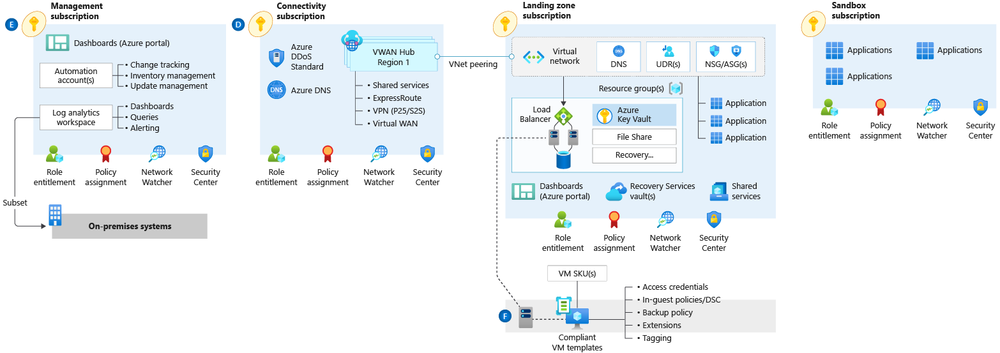
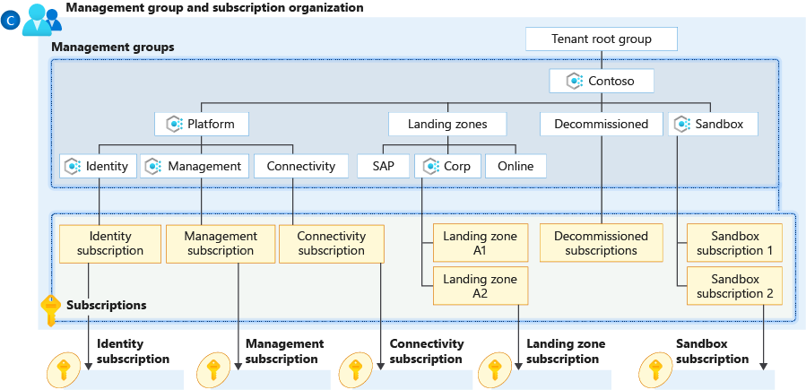
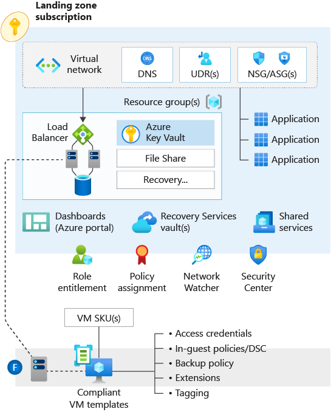
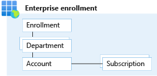
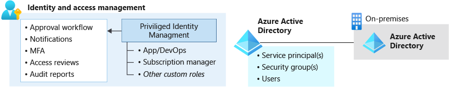
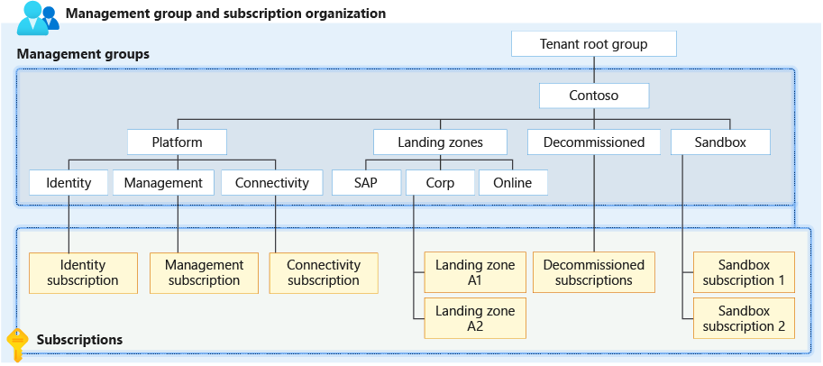
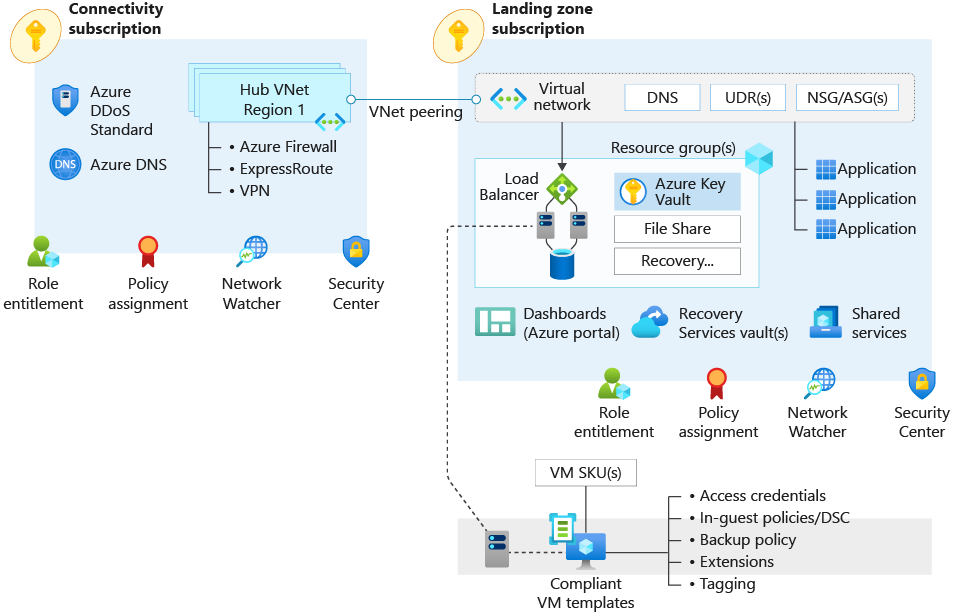

# Enterprise-scale architecture in Azure

## Cloud Adoption Framework Enterprise Scale Landing Zone Design

### Public Resources

See [enterprise-scale architecture diagram PDF](https://raw.githubusercontent.com/microsoft/CloudAdoptionFramework/master/ready/enterprise-scale-architecture.pdf)

### Introduction to enterprise-scale landing zones in the Microsoft Cloud Adoption Framework for Azure

<https://docs.microsoft.com/en-us/learn/modules/enterprise-scale-introduction>

It's a major shift for a centralized IT organization in this scenario to move from providing all the infrastructure (such as buildings for people to live or work in) to providing the zoning guidelines (guardrails that are established so that other business units can build their infrastructure and applications).

- Architecture complexity: When an organization lacks the required level of understanding and experience on Azure, cloud adoption can be challenging. 

- Operating compatibility: Existing approaches and functions for the traditional delivery and management of IT services aren't compatible with the Azure platform and cloud operating models. -> Organizations need an sample continuous integration and continuous delivery (CI/CD) pipeline that has an enterprise-scale approach to help them.

- Lack of trust and desire for control: The absence of a detailed, compliant cloud architecture and a well-defined operating model to support such a platform might lead an IT team to distrust Azure, and instead try to maintain full control. The desire to maintain control often involves building walls and complicated processes, which ultimately get in the way of the business units that are adopting Azure.

establish the following practices:

- Platform architecture in production: Ensure that key foundational services, such as identity and access management, security, networking, monitoring, and shared infrastructure services, are in place.
- Cloud operating model: To support the platform architecture, ensure that a cross-functional capability that combines engineering and operations is in place.
- Democratization: Ensure that subscriptions, aligned with the platform architecture, are unblocked and provided to business units for the design, development, and testing that are needed to migrate workloads.
- Application-centric migration: An organization must support both existing application migrations and new application development, without discriminating between infrastructure as a service (IaaS) or platform as a service (PaaS) approaches.

organizations must address for successful cloud adoption:

- Platform operations and management
- Platform DevOps
- Subscription organization and governance
- Application landing zones
- Identity and access management
- Policy management
- Security and compliance
- Network topology and connectivity
- Shared services infrastructure
- Business continuity and disaster recovery
- Service management
- Service catalog

To design an architectural platform isn't enough. The organization not only must implement and maintain the platform, but it also must design a systematic architectural and technical delivery approach to building patterns for success on the platform.

- Subscription democratization: Use subscriptions as a unit of management and scale that's aligned with business needs and priorities. This approach supports business areas and portfolio owners as they accelerate application migrations and new application development.

- Policy-driven governance: Apply Azure Policy to provide guardrails and ensure continued compliance with your organization's platform, along with the applications that are deployed onto it.

- Single control and management plane: Enterprise-scale architecture shouldn't consider any abstraction layers, such as customer-developed portals or tooling. It should provide a consistent experience for both AppOps (centrally managed operation teams) and DevOps (dedicated application operation teams).

- Application-centric and archetype-neutral approach: Enterprise-scale architecture should focus on application-centric migrations and development rather than pure infrastructure lift-and-shift migrations, such as moving virtual machines. 

- Azure-native design and platform roadmap alignment: The enterprise-scale architecture approach favors using Azure-native platform services and capabilities whenever possible. It's crucial to align with the Azure platform roadmap to ensure that new capabilities are made available within customer environments.

- Enterprise-scale architecture definition and composition approach: Through an enterprise-scale architecture approach and reference implementation, you enable the effective construction and operationalization of landing zones on Azure, at scale and aligned with the Azure roadmap and the Microsoft Cloud Adoption Framework for Azure. Enterprise-scale architecture represents the strategic design path and target technical state of your Azure environment. The architecture will continue to evolve along with the Azure platform, and it's ultimately defined by design decisions that are aligned with the principles to safeguard your Azure journey.

- Scope: With enterprise-scale landing zones, the scope of a landing zone grows considerably to support application migrations and green field development at scale in Azure.

- Refactoring: The number of subscriptions that are required to support a full enterprise-scale IT portfolio can be large. Initially, the Cloud Adoption Framework encourages a high frequency of refactoring, which should stabilize before the tenth production workload is deployed to the cloud. When you work across an enterprise portfolio, ten applications can be deployed quickly and make refactoring impractical. Instead, a central IT team or a cloud center of excellence should deliver a more complete landing zone during the first release.

- Goal: Provide consistent landing zones based on an application archetype subscription strategy to minimize subscription sprawl. Expand the definition of requisite components to better fit the governance and compliance needs of a cloud-mature enterprise.

- Principal purpose: Limited refactoring opportunities and a defined subscription strategy create an opportunity to mature your organization's landing zones faster. Enterprise-scale landing zones broaden the primary purpose of a landing zone to focus on aspects of governance, compliance, security, and operational management. Each of these areas is addressed in the first release of the landing zone and supporting shared platform services.

meet your organization's critical requirements as they relate to:

- Business continuity and disaster recovery at platform and application levels.
- Service management, such as incident response and support.
- A service catalog, such as configuration management database.

### Subscription democratization

Subscriptions are units of management and scale that are aligned with an organization's business goals and priorities. Avoid maintaining centralized control and management of subscriptions, and allow business units to manage subscriptions themselves. Azure policies are applied to provide the necessary guardrails. Policy helps to provide application owners both sufficient freedom and a secure path.

Critical design areas:

- Enterprise enrollment and Azure Active Directory (Azure AD) tenants: An Enterprise Agreement (EA) enrollment represents the commercial relationship between Microsoft and how your organization uses Azure. It provides the basis for billing across all your subscriptions and affects the administration of your digital estate.
- Identity and access management: Identity and access management provides the basis of a large part of security assurance. To protect data and resources, it enables access based on identity authentication and authorization controls, and it helps you decide which requests should be permitted.
- Management group and subscription organization: When an organization plans Azure adoption at scale, it must thoroughly consider management group structures within an Azure AD tenant. A well-defined management group and subscription organization simplifies the management of Azure Policy and role-based access control (RBAC) assignments.
- Network topology and connectivity: There are key design considerations and recommendations surrounding networking and connectivity to, from, and within Azure. Network topology is a critical element of an enterprise-scale architecture, because it defines how applications can communicate with each other.
- Management and monitoring: A management and monitoring process gives central teams key recommendations for maintaining operational visibility within a large-scale Azure platform. This is a key consideration for operationally maintaining an Azure enterprise estate with centralized management and monitoring at a platform level.
- Business continuity and disaster recovery: Organizations capture disaster recovery (DR) requirements to design suitable platform-level capabilities that application workloads can consume. This helps organizations reach their specific recovery time objectives (RTOs) and recovery point objectives (RPOs) in Azure.
- Security, governance, and compliance: This critical design area covers encryption and a framework for assessing the enterprise security readiness of Azure services.
- Platform automation and DevOps: Many traditional IT operating models aren't compatible with the cloud. In this section, we look at planning for a platform DevOps approach, as well as central and federated responsibilities.

### Enterprise-scale architecture organizational design principles

<https://docs.microsoft.com/en-us/learn/modules/enterprise-scale-organization>

An Enterprise Agreement (EA) enrollment represents the commercial relationship between Microsoft and how your organization uses Azure. It provides the basis for billing across all your subscriptions and affects the administration of your digital estate. Your EA enrollment is managed via an Azure EA portal. An enrollment often represents an organization's hierarchy, which includes departments, accounts, and subscriptions. This hierarchy represents cost-enrollment groups within an organization. You can also create and manage API keys for your enrollment to consume financial data in external systems.

- Departments help to segment costs into logical groupings and to set a budget or quota at the department level. The quota isn't firmly enforced, and is used for reporting purposes.
- Accounts are organizational units in the Azure EA portal. They're used to manage subscriptions and access reports.
- Subscriptions are the smallest unit in the Azure EA portal. Subscriptions act as containers for Azure services managed by the account owner. Your organization deploys Azure services into its subscriptions.

Enterprise user roles:

- Enterprise administrator - This role has the highest level of access and can manage account owners, enterprise admins, and department admins. The account can also view usage across departments and accounts, as well as billed and unbilled charges. This role can also manage notification contacts.
- Department administrator - This role allows you to manage your departments, create new account owners under a department, view usage details for departments that are managed by the department admin, and view cost. Department admins can be granted read-only access. You might have multiple department admins for each enterprise enrollment.
- Account owner - Account owners can create and manage subscriptions and view usage for subscriptions. Account Owner is the only EA portal role with direct access to all resources in a subscription. This user will be assigned as service admin on the subscription scope.
- Service administrator - The service admin role has permissions to manage services in the Azure portal and assign users to the co-admin role.
- Notification contact - This account receives notifications about usage and general communication such as enrollment lifecycle information related to enrollment.

Enterprise enrollment design recommendations and considerations

Recommendations:

- Only use the Work or school account authentication type for all account types. Avoid using the Microsoft account type.
- Set up the notification contact email address to ensure that notifications are sent to an appropriate group mailbox.
- Assign a budget for each account, and establish an alert associated with the budget.
- An organization can have a variety of structures, such as functional, divisional, geographic, matrix, or team structure. Use organizational structure to map your organization structure to your enrollment hierarchy.
- Create a new department for IT if business domains have independent IT capabilities.
- Restrict and minimize the number of account owners within the enrollment to avoid the proliferation of privileged access to subscriptions and associated Azure resources.
- If you use multiple Azure Active Directory (Azure AD) tenants, verify that the account owner is associated with the same tenant in which subscriptions for the account are provisioned.
- Set up enterprise dev/test and production environments at an EA account level to support holistic isolation.
- Don't ignore notification emails sent to the notification account email address. Microsoft sends important EA-wide communications to this account.
- Don't move or rename an EA account in Azure AD.
- Periodically audit the EA portal to review who has access, and avoid using a Microsoft account when possible.

Considerations:

- The enrollment provides a hierarchical organizational structure to govern the management of subscriptions
- Multiple environments can be separated at an EA-account level to support holistic isolation.
- There can be multiple admins appointed to a single enrollment
- Each subscription must have an associated account owner
- Each account owner will be made a subscription owner for any subscriptions provisioned under that account
- A subscription can belong to only one account at any given time
- A subscription can be suspended based on a specified set of criteria

Azure AD tenants design recommendations and considerations

Recommendations:

- Use Azure AD seamless single sign-on based on the selected planning topology.
- If your organization doesn't have an identity infrastructure, start by implementing an Azure AD-only identity deployment. Such a deployment with Azure Active Directory Domain Services and Microsoft Enterprise Mobility + Security provides end-to-end protection for SaaS applications, enterprise applications, and devices.
- Multifactor authentication provides another layer of security the second barrier of authentication. Enforce multifactor authentication and Conditional Access policies for all privileged accounts for greater security.
- Plan for and implement emergency-access or break-glass accounts to prevent tenant-wide account lockout.
- Use Azure AD Privileged Identity Management for identity and access management.
- If dev/test and production are going to be isolated environments from an identity perspective, separate them at a tenant level via multiple tenants.
- Avoid creating a new Azure AD tenant unless there's a strong identity and access management justification and processes are already in place.

Considerations:

- Multiple Azure AD tenants can function in the same enrollment

### Identity and access management

Azure Active Directory (Azure AD) role-based access control (RBAC) and custom role definitions.

common design considerations and recommendations to consider for an enterprise landing zone:

Custom RBAC Roles
<https://docs.microsoft.com/en-us/learn/modules/enterprise-scale-organization/3-identity-access-management>

- Azure platform owner: Used for management group and subscription lifecycle management.
- Network management (NetOps): Used for platform-wide global connectivity management of virtual networks, user data repositories, network security groups, network virtual appliances, virtual private networks, Azure ExpressRoute, and others.
- Security operations (SecOps): Security administrator role with a horizontal view across the entire Azure estate.
- Subscription owner: A delegated role for subscription owner derived from subscription owner role.
- Application owners (DevOps/AppOps): Contributor role granted for application/operations team.

Design recommendations and considerations for identity and access management:

- There's a limit of 2,000 custom RBAC role assignments per subscription.
- There's a limit of 500 custom RBAC role assignments per management group.

- Shared resources or any aspect of the environment that implements or enforces a security boundary, such as the network, must be managed centrally. This requirement is part of many regulatory frameworks. It's standard practice for any organization that grants or denies access to confidential or critical business resources.
- Managing application resources that don't violate security boundaries or other aspects required to maintain security and compliance can be delegated to application teams. Allowing users to provision resources within a securely managed environment allows organizations to take advantage of the agile nature of the cloud while preventing the violation of any critical security or governance boundary.

Deploy Azure AD conditional-access policies for any user with rights to Azure environments. Doing so provides another mechanism to help protect a controlled Azure environment from unauthorized access. Enforce multifactor authentication for any user with rights to the Azure environments.

Use Azure AD Privileged Identity Management (PIM) to establish zero standing access and least privilege. Map your organization's roles to the minimum level of access needed. Use Azure AD PIM access reviews to periodically validate resource entitlements. Use Azure AD-only groups for Azure control-plane resources in Azure AD PIM when you grant access to resources. Add on-premises groups to the Azure AD-only group if a group management system is already in place.

Integrate Azure AD logs with the platform-central Azure Monitor

If any data sovereignty requirements exist, you can deploy custom user policies to enforce them.

Use Microsoft Defender for Cloud just-in-time access for all infrastructure as a service (IaaS) resources to enable network-level protection for ephemeral user access to IaaS virtual machines.

Use Azure AD managed identities for Azure resources to avoid authentication based on user names and passwords.

Use privileged identities for automation runbooks that require elevated access permissions. Automated workflows that violate critical security boundaries should be governed by the same tools and policies that users of equivalent privilege are.

Don't add users directly to Azure resource scopes. This lack of centralized management greatly increases the management required to prevent unauthorized access to restricted data.

A critical design decision that an enterprise organization must make when adopting Azure is whether to extend an existing on-premises identity domain into Azure or to create a brand new one. To deploy Active Directory Domain Services (AD DS) in Windows Server, Azure AD DS, or both.

If an organization has a scenario where an application that uses integrated Windows authentication must be accessed remotely through Azure AD, consider using Azure AD Application Proxy.

Use managed identities instead of service principals for authentication to Azure services.

### Management group and subscription organization

Properly organizing your subscriptions will play a key role in governance for your cloud resources. It also ensures you can manage the costs for resources and quotas for deployed resources in your organization.

#### Define a management group hierarchy

When you define the management-group hierarchy, consider if management groups can be aggregated by policy and initiative assignments via Azure Policy. This capability will provide flexibility and organization of policy across multiple subscriptions. Also, keep in consideration that a management group tree can support up to six levels of depth. This limit doesn't include the tenant root level or the subscription level.

We recommend that you keep the management-group hierarchy reasonably flat, ideally with no more than three to four levels. This restriction will reduce management overhead and complexity. Management groups should be used for policy assignments versus billing purposes.

Create management groups under your root-level management group to represent the types of workloads (archetypes) that you'll host and ones based on their security, compliance, connectivity, and feature needs. This grouping structure allows you to have a set of Azure policies applied at the management-group level for all workloads that require the same security, compliance, connectivity, and feature settings.

Create a top-level sandbox management group to allow users to immediately experiment with Azure. Users can then experiment with resources that might not yet be allowed in production environments. The sandbox provides isolation from your development, test, and production environments.

Use a dedicated service principal name (SPN) to execute management group management operations, subscription management operations, and role assignment. Using an SPN reduces the number of users who have elevated rights and follows least-privilege guidelines.

Assign the User Access Administrator role provided by Azure role-based access control (RBAC) at the root management group scope (/) to grant the just-mentioned SPN access at the root level. After the SPN is granted permissions, the User Access Administrator role can be safely removed. In this way, only the SPN is part of the User Access Administrator role.

Assign the Contributor role to the SPN previously mentioned at the root management group scope (/), which allows tenant-level operations. This permission level ensures that the SPN can be used to deploy and manage resources to any subscription within your organization.

Create a platform-management group under the root management group to support common platform policy and RBAC assignment. This grouping structure ensures that different policies can be applied to the subscriptions used for your Azure foundation. It also ensures that the billing for common resources is centralized in one set of foundational subscriptions.

Limit the number of Azure Policy assignments made at the root management group scope (/). This limitation minimizes debugging inherited policies in lower-level management groups. Don't create any subscriptions under the root management group. This hierarchy ensures that subscriptions don't inherit only the small set of Azure policies assigned at the root-level management group, which doesn't provide a full set necessary for a workload.

#### Subscription organization and governance

Subscriptions are a unit of management, billing, and scale within Azure. They play a critical role when you're designing for large-scale Azure adoption.

Subscriptions serve as boundaries for assigning Azure policies. (PCI) workloads typically require additional policies to achieve compliance. Instead of using a management group to group workloads that require PCI compliance, you can achieve the same isolation with a subscription.

Subscriptions also serve as a scale unit so that component workloads can scale within the platform subscription limits. Make sure to consider subscription resource limits.

When defining your subscription organization and governance, treat subscriptions as a democratized unit of management aligned with business needs and priorities.

- Perform an access review in Azure AD Privileged Identity Management quarterly or twice a year to ensure that privileges don't proliferate as users move within the customer organization.
- Take full ownership of budget spending and resource utilization.
- Ensure policy compliance and remediate when necessary.

Group subscriptions together under management groups aligned within the management group structure and policy requirements at scale. Grouping ensures that subscriptions with the same set of policies and RBAC assignments can inherit them from a management group, which avoids duplicate assignments.

Establish a dedicated management subscription in the platform-management group to support global management capabilities, such as Azure Monitor Log Analytics workspaces and Azure Automation runbooks. Establish a dedicated identity subscription in the platform-management group to host Windows Server Active Directory domain controllers, when necessary. Establish a dedicated connectivity subscription in the platform-management group to host an Azure Virtual WAN hub, private domain name system (DNS), ExpressRoute circuit, and other networking resources. A dedicated subscription ensures that all foundation network resources are billed together and isolated from other workloads.

#### Establish cost management

Consider a potential need for chargeback models where shared platform as a service (PaaS) resources are concerned, such as Azure App Service Environment and Azure Kubernetes Service, which might need to be shared to achieve higher density. Use a shutdown schedule for nonproduction workloads to optimize costs. Use Azure Advisor to check cost optimization recommendations.

We recommend the use of Azure Cost Management + Billing for cost aggregation. Make it available to application owners. Use Azure resource tags for cost categorization and resource grouping. Using tags allows you to have a chargeback mechanism for workloads that share a subscription or for a given workload that spans across multiple subscriptions.

### Network design principles for enterprise-scale architecture

<https://docs.microsoft.com/en-us/learn/modules/enterprise-scale-networking>

One of the most critical considerations is to not use overlapping RFC 1918 (private) IP space with on-premises or other clouds. Keep in mind that Azure will reserve five IP addresses for each subnet in a virtual network. Also note that some Azure services, like an Azure ExpressRoute gateway or Azure Firewall, will require dedicated subnets.

Plan the cloud IP schema well in advance. Each Azure region should get its own easily summarized range. For instance, 10.1.0.0/16 is West US 2 and 10.2.0.0/16 is North Europe.
Make sure to stick with private IP space. Use public IPs only if you own them and are out of private IP space.

#### DNS planning for enterprise-scale

If you need only resolution inside an Azure virtual network, use Azure Private DNS to minimize your operational and administrative effort. For cross-premises resolution, deploy at least two DNS resolvers per Azure region into an Azure virtual network. Configure the virtual networks to use those resolvers. This allows for DNS resolution to not be affected by latency or be offline because of a single VM failure. Use zone-redundant services where available.

Use conditional forwarders with Azure Private DNS so that on-premises servers can resolve Azure VMs and platform as a service (PaaS) service names.

Enable DNS autoregistration for Azure VMs, so VMs can locate each other by name.

Use an Azure Private DNS zone in the global connectivity subscription. You might need more zones for services such as Azure Private Link.

#### Network topology for enterprise-scale

For enterprise-scale, we recommend two approaches for network topologies in Azure: a network topology based on Azure Virtual WAN or the traditional hub-and-spoke model.

##### Azure Virtual WAN

Azure Virtual WAN is a Microsoft-managed solution that provides global transit connectivity by default. Virtual WAN hubs eliminate the need to manually configure network connectivity. Virtual WAN also offers communication between on-premises locations by using the Microsoft network, Azure ExpressRoute, and VPN.

Virtual WAN simplifies end-to-end network connectivity in Azure and cross-premises by creating a hub-and-spoke network architecture. The architecture spans multiple Azure regions and on-premises locations (any-to-any connectivity) out of the box. A design consideration for any networking in Azure is to keep in mind the principle that Azure-to-Azure traffic should always stay in Azure.

Recommendations:

Virtual WAN for new large or global network deployments in Azure where you need global transit connectivity across Azure regions and on-premises locations. That way, you don't have to manually set up transitive routing for Azure networking.

Deploy a Virtual WAN hub per Azure region, and connect the hubs to large offices or datacenters by using ExpressRoute. Use VPN for smaller locations and point-to-site VPN for remote users. Azure Firewall can be deployed in a Virtual WAN hub, but partner firewalls have to be deployed in a spoke virtual network.

There's no need to build a transit network on top of Virtual WAN. Virtual WAN is the transit network. Virtual WAN is limited to 2,000 virtual machines per hub.

##### Hub and spoke

Considerations - Use the hub-and-spoke model if:

- You have no requirements for branch-to-branch communications
- You don't need SD-WAN integrated solutions
- You need highly granular routing control
- You'll deploy more than 2,000 virtual machines per hub

When multiple ExpressRoute circuits are connected to the same virtual network, you must use connection weights or Border Gateway Protocol (BGP) techniques to ensure an optimal path for traffic between on-premises and Azure. If you use connection weights, BGP AS prepending is ignored.

Recommendations:

Each Azure region should have a hub and firewalls. ExpressRoute or VPN gateways should be deployed in that hub so that all spoke virtual networks can route through the hub or use shared services like DNS deployed there.

Use multiple ExpressRoute circuits for these reasons:

- For resiliency, in different peering locations and different providers if possible
- For dedicated bandwidth to projects or to production, to avoid "noisy neighbor" problems

##### Connectivity options for enterprise-scale

###### Connectivity to Azure

Azure ExpressRoute is private, dedicated connectivity to Azure and is the preferred approach for the enterprise over virtual private network (VPN). You can configure VPN as a backup route if ExpressRoute(s) fail. Because VPNs use the internet, latency can be inconsistent.

Select ExpressRoute Direct or a provider by matching your requirements for peering locations. Connect to the Microsoft network with as little latency as possible. If you need more than 10 Gbps or multiple circuits that total more than 10 Gbps, consider ExpressRoute Direct. ExpressRoute Direct is a layer 2 connection from your hardware to Microsoft's inside a peering location, and it goes up to 100 Gbps.

Ensure that you use the right SKU for the ExpressRoute or VPN gateways based on bandwidth and performance requirements. Otherwise, you'll be either paying too much or not getting full throughput.

Be sure to deploy zone-redundant gateways where possible. When throughput from on-premises to Azure must be greater than 10 Gbps, or you need to minimize latency, enable FastPath to bypass the ExpressRoute gateway from the data path.

Proactively monitor ExpressRoute circuits by using Network Performance Monitor. Use multiple ExpressRoute peering locations for resiliency. To avoid noisy-neighbor risks, don't use the same ExpressRoute circuit to connect multiple environments that require isolation or dedicated bandwidth.

###### Connectivity with the public internet

When you're using Azure Firewall, use Firewall Manager with Azure Virtual WAN to deploy and manage Azure Firewall across Virtual WAN hubs or in hub virtual networks. Firewall Manager is now in general availability (GA) for both Virtual WAN and regular virtual networks. Firewall Manager allows for Azure Firewall to be managed at scale. Create a global Azure Firewall policy to govern security posture across the global network environment, and assign it to all Azure Firewall instances.

When you're using Azure Front Door and Azure Application Gateway to help protect HTTP/S apps, use WAF policies in Azure Front Door and lock down Azure Application Gateway to receive traffic only from Azure Front Door. Use Azure DDoS Protection Standard protection plans to help protect all public endpoints hosted within your virtual networks. DDoS Protection Standard provides SLA-backed distributed denial of service (DDoS) protection and log data.

Also, use Azure Firewall or a network virtual appliance from a partner to control the IP addresses that virtual machines use to access the internet. 

###### Connectivity to PaaS services

Azure Private Link provides dedicated access by using private IP addresses to Azure PaaS instances, or custom services behind Azure Load Balancer Standard. Virtual network injection provides dedicated private deployments for supported services. With virtual network injection, management-plane traffic flows through public IP addresses. Private Link is the preferred solution to help secure PaaS services.

##### Network segmentation planning for enterprise-scale

Considerations:

Design based on zero trust and assumed breach. Systems should be able to communicate with each other only on the ports and protocols that the applications need. Here are a few key items to remember:

- Application security groups don't span virtual networks.
- Network security groups are stateful, but are not firewalls. They're access control lists.
- Azure Firewall is available from Microsoft. You can also find partner firewalls in Azure Marketplace.

Recommendations:

Delegate subnet creation to the owner of the landing zone. This will let the owner define how to segment workloads across subnets (for example, a single large subnet or a multitier app).

The platform team can use Azure Policy to ensure that a network security group with specific rules is always associated with subnets that have deny-only policies. An example of a specific rule is denying inbound SSH or RDP from the internet, or allowing/blocking traffic across landing zones.

Use network security groups to restrict traffic between subnets and other east/west traffic, and use firewalls for north/south traffic. Be sure to enable flow logs for network security groups and feed them into Traffic Analytics in order to audit traffic or debug network flows. Use network security groups selectively for traffic between landing zones.

##### Network encryption planning for enterprise-scale

Traffic for Azure ExpressRoute private peering isn't currently encrypted. Whenever Azure customer traffic moves between Azure datacenters, it's encrypted through the IEEE 802.1AE MAC Security standard (also known as MACsec). MACsec encryption is also possible when you're using ExpressRoute Direct. With Azure Virtual WAN, you can encrypt traffic for ExpressRoute private peering by using an IPSec tunnel of private (RFC1918) IP space.

When you're using ExpressRoute Direct, encrypt traffic by using MACSec. If you need end-to-end encryption, use IPSec tunnels on top of ExpressRoute. There's no performance degradation on the Microsoft hardware when you're using MACSec, but check with your hardware vendor to understand performance implications of MACSec on your devices.

### Enterprise-scale architecture operational design principles

<https://docs.microsoft.com/en-us/learn/modules/enterprise-scale-operations>

